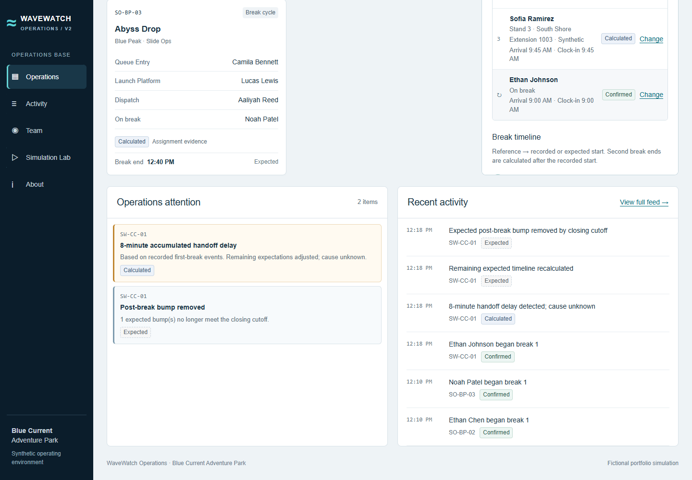
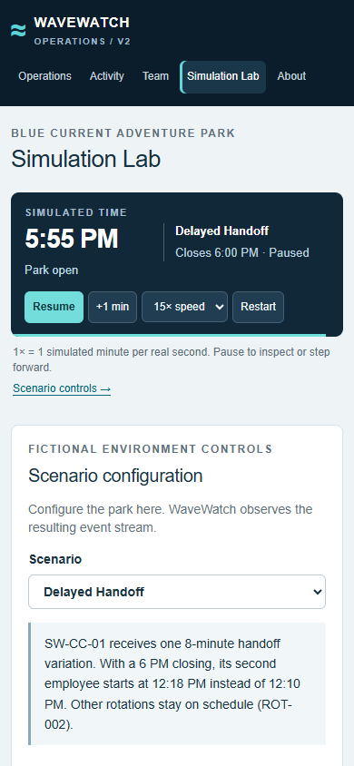
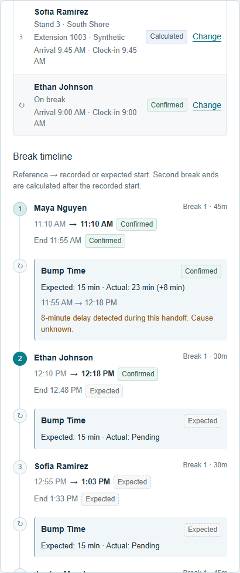

# WaveWatch Operations V2

An event-driven operations analytics portfolio project for **Blue Current Adventure Park**, a completely fictional water park. Practice working at Operations Base during a simulated day: find employees, inspect rotations, observe breaks, detect handoff delays, and see the remaining schedule change.

**Live demo:** [Explore WaveWatch Operations](https://wavewatch-operations.alejandrodelgagonza.chatgpt.site/)

**Status:** Functional portfolio prototype with a deterministic operating-day simulator, a seven-day historical analytics dataset, responsive views and automated verification.

The project investigates a practical question: **how can software organize incomplete operational records without presenting estimates as facts?**

All people, IDs, attractions, schedules and activity are synthetic. This project is not affiliated with any employer, does not represent real employer procedures, and is **not intended for real-world safety-critical aquatic operations**.

## Project ownership and development approach

WaveWatch was jointly conceived, designed, analyzed, validated and developed by [Alejandro Delgado Gonzalez](https://github.com/AlejandroDelgadoGonzalez) and [Jesus Delgado Gonzalez](https://github.com/Jesus-dg). They developed the project through a paired collaboration, sharing product decisions, operational analysis, scenario validation, testing and AI-assisted implementation.

The initial work was completed together on a shared computer and GitHub account, so the early commit history does not represent exclusive individual authorship. Both collaborators remain jointly responsible for the requirements, evidence boundaries, synthetic-data design, testing, interpretation and final product decisions. The repository documents assumptions and limitations so that AI-generated implementation is not treated as unquestioned authority. See [AUTHORS.md](AUTHORS.md) for the authorship record.

### At a glance

- Models 74 synthetic employees across 17 rotations, 12 attractions and four fictional zones.
- Replays normal, delayed and seeded operating days with a deterministic event-driven simulator.
- Generates seven completed fictional days and 765 handoff records for descriptive analytics.
- Separates `Confirmed`, `Calculated` and `Expected` information throughout the interface.
- Verifies scheduling parity, simulation behavior, analytics, rendering, lint and types with `npm run verify`.

## Simulator vs. WaveWatch

```text
Scenario configuration + seed
             |
    Simulation Engine       Fictional source: owns future timing
             |
    Recorded event stream   Only events reached by the virtual clock
             |
    WaveWatch projection    Interprets evidence, detects delays, forecasts
             |
    Current park state
             |
    Operations dashboard    Views and controls, not scheduling policy
```

Python remains the reference scheduling engine. A generated, checked JSON contract shares its break matrices and reference timelines with the browser. TypeScript implements the event clock and evidence-driven projection; parity tests verify all four closing schedules against Python. No Python server or external database is required to run the dashboard.

## What V2 includes

- Existing **4 zones, 12 attractions, 17 rotations and 74 synthetic employees**; no duplicate roster in UI components.
- Deterministic virtual clock: start, pause, resume, restart, one-minute step, and 1x / 5x / 15x speeds. **1x means one simulated minute per real second.**
- Operations overview, zone/role/name filters, all-rotation board, employee search, position detail and a reference-versus-observed break timeline.
- Structured activity feed, handoff attention items, cumulative delay propagation, and closing-cutoff removal of post-break bumps.
- Simulation Lab with scenario/closing/seed selection, forward checkpoints and clearly labeled experimental observation notes.
- Consistent **Confirmed / Calculated / Expected** evidence labels. Second-break ends are never fabricated as source records.

## Data & Analytics

WaveWatch now demonstrates an end-to-end analytics workflow: **Simulation → Data Generation → Transformation → Analytics → Visualization → CSV Export**. Open **Data & Analytics** in the sidebar to explore seven completed fictional operating days, separate from the live Operations dashboard.

The demonstration week is September 7–13, 2026. Seed **20260919** deterministically generates timing variation across the existing 17 rotations, four zones and synthetic roster. It reuses the simulation engine, break entitlements, closing-time rules and Expected post-break Extra activity. Quiet days, busier days, recurring rotation-level variations and occasional outliers come from seeded scenario inputs—not hand-authored chart results.

The pipeline separates responsibilities:

1. **Generation:** `analytics/generate.ts` supplies seeded source observations to the existing simulation engine and completes each operating day.
2. **Transformation:** `analytics/transform.ts` turns adjacent break observations into normalized handoff records linked by rotation and employee IDs. Missing second-break ends remain Calculated, never Confirmed source observations.
3. **Dataset:** `analytics/dataset.ts` exposes an isolated, reproducible historical week. Live scenario changes and employee swaps do not rewrite historical records.
4. **Analysis:** `analytics/metrics.ts` owns filtering, descriptive statistics, grouped summaries, analytical delay buckets, sorting and deterministic insights. UI components do not implement their own business formulas.
5. **Presentation:** five coordinated visualizations show weekly on-time rates, average transition by rotation, on-time/delayed shares, daily accumulated delay and delay-size distribution. Rotation and employee-associated views provide detailed metrics and handoff history.
6. **Export:** Data Explorer searches and sorts the current selection, pages through records and exports **all matching rows** to CSV—not only the visible page.

The only operational delay boundary is the existing **15-minute transition allowance**. Transition = next break start − previous break end; delay = max(0, transition − 15). Average delay includes **delayed handoffs only**. Empty selections display “—” for undefined averages instead of fabricated zeroes. Weekly rates are weighted by handoff count, not averages of daily percentages. Total accumulated delay sums handoff intervals and is not equivalent to park downtime.

Filters for day, zone, employee group, rotation, employee association and free-text search update KPIs, charts, history, insights and export together. Green means On Time, orange means Delayed, blue identifies the allowance and teal identifies selection/context. Labels, values, patterns and keyboard-accessible tooltips supplement color. Employee association never implies causation, grades or a ranking.

Reproduce the generated files locally:

```bash
npm run analytics:export
```

This writes `outputs/analytics/blue_current_demo_week.json`, a joined CSV and `completed_days.json` containing completed simulation states and events. Outputs are generated and git-ignored; their source of truth is the generator plus the checked Python scheduling contract. No paid services, LLM, external dataset or database are needed.

For a recruiter or interviewer, this feature demonstrates **Python scheduling foundations, synthetic data generation, data transformation, descriptive analytics, operational KPIs, data visualization, reproducible pipelines, simulation and software engineering**. Python remains the tested scheduling authority; TypeScript handles event simulation and the browser-facing analytics pipeline. The seed represents a designed demonstration scenario, not measured behavior or a predictive employee model.

See [analytics architecture and methodology](docs/analytics.md) and [analytics verification](docs/analytics_qa.md) for definitions, reproducibility details, evidence limitations and QA.

## Core rotation rules

Generic positions remain `Stand 1 → Stand 2 → Stand 3 → Break/Extra → Stand 1`. Attraction-specific labels are display mappings only.

Employees arriving at 8:00, 9:00 and 9:45 start at Stand 3, Stand 2 and Stand 1 respectively. The 11:00 breaker initiates the first handoff; the first recorded break is expected at 11:10. Subsequent handoffs allow 15 minutes after the preceding break end. Break durations use the existing documented closing-time matrix, not a newly inferred policy. Shifts end 30 minutes after closing.

Positions advance together at recorded break starts as a **Calculated** projection; there is no position sensor. Final and post-break bumps remain **Expected**. Additional bumps require at least 30 minutes before closing. Delays belong to handoff windows; the records do not prove who or what caused them.

### Acceptance scenarios (6 PM closing)

| Scenario | Last break end | Final bump | Additional bump | Final slots: Stand 1 / 2 / 3 / Extra |
| --- | --- | --- | --- | --- |
| ROT-001: normal | 4:40 PM | 4:55 PM | 5:25 PM | Dakota / Cameron / Blake / Avery |
| ROT-002: delayed | 4:48 PM | 5:03 PM | None; 5:33 exceeds 5:30 cutoff | Cameron / Blake / Avery / Dakota |

Test aliases map by arrival slot to SW-CC-01: Avery = Maya Nguyen, Blake = Ethan Johnson, Cameron = Sofia Ramirez, Dakota = Jordan Morales. The approved roster is unchanged.

## Scenarios

1. **Normal Operating Day:** reference timing for every rotation.
2. **Delayed Handoff:** an eight-minute variation in SW-CC-01's second break-start record. At 6 PM closing, 12:10 becomes 12:18. WaveWatch cannot see this future record before it occurs.
3. **Seeded Dynamic Day:** occasional synthetic 1–4 minute handoff variations. The same closing time and unsigned 32-bit seed produce the same source stream and state. Variation parameters are not staffing policies.

## Install and run

Requirements: Node.js **22.18+** (Node 24 recommended), npm, and Python **3.10+** for reference tests/contract generation. No paid service, API key or database account is needed.

```bash
npm ci
npm run dev
```

Open the local URL printed by the server (normally `http://localhost:3000`). The day starts at 7:30 AM, the first coordinator arrival. Choose **Simulation Lab**, select a scenario and closing, then **Apply & restart scenario**. Return to Operations and start the clock. Pause to inspect a rotation or use a Lab checkpoint to process all intervening events.

To preview the compiled Worker locally, run `npm run build` followed by `npm start` and open `http://127.0.0.1:3001`. This uses Wrangler's local runtime on all platforms. The inherited Vinext Node production server uses Windows filesystem separators as asset URL keys and returns 404 for nested assets on Windows; using the existing Worker runtime avoids that upstream issue without patching installed dependencies.

Stop the compiled preview with Ctrl+C before rebuilding, then start it again. Its local runtime state is kept outside build output in ignored `.wrangler/preview`.

At 15x, an eleven-hour day takes about 44 real seconds while the tab is active. Background throttling slows the run rather than skipping unseen hours. Refreshing starts a new run.

## Verify

```bash
npm run verify
```

Runs Python regression tests, contract drift check, TypeScript simulation tests, production build, server-rendering tests, ESLint and TypeScript typecheck. Individual commands:

```bash
npm run test:python
npm run test:contract
npm run test:simulation
npm run build
npm run test:ssr
npm run lint
npm run typecheck
```

After an intentional Python policy change, regenerate the contract with `python scripts/export_simulation_contract.py` and review its diff. Cloudflare runtime declarations are generated with `npm run types:runtime` after a build; the optional database binding is separately declared in `cloudflare-env.d.ts`.

### Browser interaction and visual checks

Browser QA is optional so ordinary installation does not download a browser. With the app running in another terminal:

```bash
npm install --no-save --package-lock=false playwright
npx playwright install chromium
npm run test:ui
```

On Windows, installed Edge can be used instead of downloading Chromium:

```powershell
$env:BROWSER_CHANNEL = "msedge"
npm run test:ui
```

`QA_URL` can target another local port. Screenshots are written to ignored `outputs/v2-qa/`. See [QA report](docs/v2_qa.md).

## Screenshots







## Technology and structure

React 19, TypeScript, Vinext/Vite, CSS, Python standard library and Node's built-in test runner. Existing Cloudflare hosting and optional Drizzle/D1 scaffolding are retained, but operating-day state is local in memory.

```text
rotation_calculator.py             Tested Python scheduling reference
park_data.py                      Dataset loading and validation
data/blue_current_staffing.json    Synthetic park configuration
data/simulation_contract.json     Generated Python/browser policy contract
scripts/export_simulation_contract.py
domain/                           Shared types, schedule adapter, bump math
simulation/                       Source scenarios and virtual clock
operations/                       Evidence projection, selectors, alerts
app/                              Dashboard, rotation detail, clock lifecycle
tests/                            Python, simulation and SSR tests
scripts/browser-qa.mjs             Browser interactions and screenshots
docs/                             Original rules plus V2 audit, architecture, QA
```

## Boundaries and next discovery work

- In-memory single-tab sessions; no saved runs, multiuser synchronization or export/import yet.
- All rotations share reference arrival patterns. Explicit two-way swaps are supported for matching role, arrival, cycle position and remaining break plan; neither employee can be on break. These prototype constraints do not define real qualification policy. No late-arrival, call-out or staffing-shortage resolution policy has been invented.
- Experimental closure/intervention/shortage events are **notes only**. They do not close an attraction or change assignments.
- Coordinator/lead breaks and duties are not modeled. Their arrivals and scheduled shift end are visible.
- Walking and handoff movement are not tracked individually. Calculated assignments are not live locations; Extra assignments remain unconfirmed.
- The activity view displays the newest 150 matching events; the full structured stream stays in memory.
- Original V1 remains on `main`; V2 lives on `codex/wavewatch-v2`. Deployment is separate from local implementation.

After personally testing the simulator, prioritize **saved/replayable runs**, a **requirements journal for experimental events**, and defining **which manual confirmations Base can legitimately record**. Broader different-arrival substitutions require a person-centered scheduler; attraction closure rules still need domain definitions.

Further reading: [audit](docs/v2_audit.md), [architecture](docs/v2_architecture.md), [rotation rules](docs/rotation_rules.md), [manual scenarios](docs/manual_test_scenarios.md).
